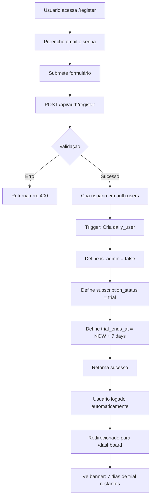
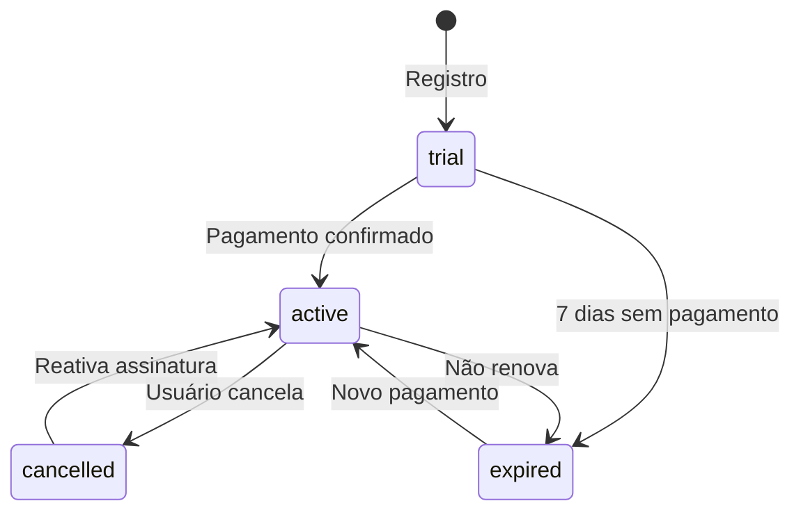

# Regras de Negócio e Controle de Acesso

## Visão Geral

Este documento descreve as regras de negócio, níveis de permissão, fluxos de cadastro e restrições de acesso do sistema Daily.

## Índice

1. [Níveis de Permissão](#níveis-de-permissão)
2. [Regras de Negócio](#regras-de-negócio)
3. [Fluxo de Cadastro](#fluxo-de-cadastro)
4. [Restrições de Acesso](#restrições-de-acesso)
5. [Período Trial](#período-trial)
6. [Gerenciamento de Assinaturas](#gerenciamento-de-assinaturas)
7. [Segurança e Auditoria](#segurança-e-auditoria)

---

## Níveis de Permissão

O sistema possui dois níveis de permissão distintos:

### 1. Usuário Comum (Padrão)

**Características:**
- Criado automaticamente no registro
- Campo `is_admin = false`
- Acesso limitado aos próprios dados
- Sujeito ao período trial de 7 dias

**Permissões:**
- ✅ Visualizar seus próprios dados
- ✅ Editar seus próprios dados (nome, telefone, enquete, horário)
- ✅ Acessar dashboard pessoal
- ✅ Visualizar histórico de atividades próprias
- ❌ Listar outros usuários
- ❌ Editar outros usuários
- ❌ Criar/excluir usuários
- ❌ Alterar permissões (promover a admin)
- ❌ Gerenciar assinaturas de outros usuários

### 2. Administrador

**Características:**
- Promovido manualmente via SQL ou por outro admin
- Campo `is_admin = true`
- Acesso total ao sistema
- Não sujeito a restrições de trial/assinatura

**Permissões:**
- ✅ Todas as permissões de usuário comum
- ✅ Listar todos os usuários do sistema
- ✅ Visualizar dados de qualquer usuário
- ✅ Editar qualquer usuário
- ✅ Criar novos usuários
- ✅ Excluir usuários
- ✅ Promover/rebaixar usuários (alterar `is_admin`)
- ✅ Gerenciar assinaturas (ativar, cancelar, estender trial)
- ✅ Vincular/desvincular contas de autenticação
- ✅ Alterar emails e senhas de usuários

---

## Regras de Negócio

### RN001: Registro de Novos Usuários

**Regra:** Ao se registrar no sistema, todo novo usuário é criado como usuário comum (não administrador).

**Implementação:**
- Trigger `set_trial_period()` garante `is_admin = false` em novos registros
- Endpoint `/api/auth/register` não aceita parâmetro `is_admin`
- RLS policy `"Authenticated users can insert"` valida `is_admin = false`

**Exceção:** Não há exceção. Mesmo que um payload malicioso tente definir `is_admin = true`, será ignorado.

### RN002: Período Trial Automático

**Regra:** Todo novo usuário recebe automaticamente 7 dias de acesso gratuito a partir da data de registro.

**Implementação:**
- Trigger `set_trial_period()` define:
  - `subscription_status = 'trial'`
  - `trial_ends_at = NOW() + 7 days`
- Cálculo automático, sem intervenção manual

**Validação:** Função `is_subscription_active()` verifica se trial está válido.

### RN003: Restrição de Acesso por Assinatura

**Regra:** Usuários comuns com trial ou assinatura expirados não podem acessar funcionalidades principais do sistema.

**Implementação:**
- `DashboardContent.tsx` verifica status da assinatura
- Exibe tela de bloqueio se `subscription_status = 'expired'` ou trial expirado
- Admins (`is_admin = true`) não são afetados

**Funcionalidades bloqueadas:**
- Dashboard
- Visualização de atividades
- Edição de dados
- Envio de enquetes WhatsApp

### RN004: Gerenciamento de Usuários Restrito

**Regra:** Apenas administradores podem listar, criar, editar ou excluir outros usuários.

**Implementação:**
- Endpoint `/api/users` (GET) requer admin via `requireAdmin()` middleware
- RLS policies garantem que usuários comuns só veem próprios dados
- Frontend oculta opções de gerenciamento para não-admins

### RN005: Auto-Edição Permitida

**Regra:** Usuários comuns podem editar apenas seus próprios dados, independente do status da assinatura.

**Implementação:**
- Endpoint `/api/users/[id]/validate-edit` verifica:
  - Se é admin → permite editar qualquer usuário
  - Se não é admin → permite editar apenas se `dailyUser.id === targetUserId`
- Middleware em `/edit` redireciona se tentativa de editar outro usuário

### RN006: Promoção a Administrador

**Regra:** Apenas administradores podem promover outros usuários a administrador.

**Implementação:**
- Endpoint `/api/admin/users/[id]/update-role` requer admin
- Verifica `isUserAdmin()` antes de permitir alteração
- Log de auditoria registra quem promoveu quem

---

## Fluxo de Cadastro



### Detalhamento do Fluxo

1. **Acesso à Página de Registro** (`/register`)
   - Usuário não autenticado acessa formulário
   - Campos: email, senha, nome (opcional), telefone (opcional)

2. **Submissão do Formulário**
   - Frontend valida campos obrigatórios
   - Envia POST para `/api/auth/register`

3. **Criação da Conta de Autenticação**
   - Supabase Auth cria registro em `auth.users`
   - Gera UUID único para o usuário

4. **Criação do Perfil Daily**
   - Endpoint tenta criar registro em `daily_user`
   - Trigger `set_trial_period()` é executado automaticamente

5. **Configuração Automática**
   - `is_admin` → `false` (sempre)
   - `subscription_status` → `'trial'`
   - `trial_ends_at` → data atual + 7 dias
   - `auth_user_id` → UUID do auth.users

6. **Login Automático**
   - Sessão criada automaticamente
   - Redirecionamento para `/dashboard`

7. **Primeira Visualização**
   - Banner verde exibindo dias restantes de trial
   - Acesso completo a todas as funcionalidades

---

## Restrições de Acesso

### Por Perfil

| Recurso | Usuário Comum | Administrador |
|---------|---------------|---------------|
| Ver próprio dashboard | ✅ (se trial válido) | ✅ Sempre |
| Ver dashboard de outros | ❌ | ✅ |
| Listar usuários (`/users`) | ❌ | ✅ |
| Editar próprios dados | ✅ | ✅ |
| Editar dados de outros | ❌ | ✅ |
| Criar usuários | ❌ | ✅ |
| Excluir usuários | ❌ | ✅ |
| Promover a admin | ❌ | ✅ |
| Gerenciar assinaturas | ❌ (própria) | ✅ (todas) |
| Vincular auth_user_id | ❌ | ✅ |

### Por Status de Assinatura

| Funcionalidade | Trial Ativo | Trial Expirado | Assinatura Ativa | Admin |
|----------------|-------------|----------------|------------------|-------|
| Acessar dashboard | ✅ | ❌ | ✅ | ✅ |
| Editar dados | ✅ | ✅ (limitado) | ✅ | ✅ |
| Enviar enquetes WhatsApp | ✅ | ❌ | ✅ | ✅ |
| Ver histórico | ✅ | ❌ | ✅ | ✅ |

### Endpoints da API

#### Públicos (sem autenticação)
- `POST /api/auth/register` - Registro de novos usuários
- `POST /api/auth/login` - Login

#### Autenticados (qualquer usuário logado)
- `POST /api/auth/logout` - Logout
- `GET /api/auth/me` - Dados do usuário atual
- `GET /api/users/[id]/validate-edit` - Validar permissão de edição

#### Admin Only
- `GET /api/users` - Listar todos os usuários
- `POST /api/admin/users/[id]/update-role` - Alterar is_admin
- `POST /api/admin/users/[id]/update-subscription` - Alterar assinatura
- `POST /api/admin/users/[id]/update-email` - Alterar email
- `POST /api/admin/users/[id]/update-password` - Alterar senha
- `POST /api/admin/users/[id]/link-auth` - Vincular auth_user_id

---

## Período Trial

### Funcionamento

1. **Início do Trial**
   - Inicia automaticamente no momento do registro
   - Duração: 7 dias corridos (168 horas)
   - Não requer cartão de crédito

2. **Durante o Trial**
   - Acesso completo a todas as funcionalidades
   - Banner informativo no dashboard
   - Avisos quando faltam 2 dias ou menos

3. **Expiração do Trial**
   - Sistema verifica `trial_ends_at < NOW()`
   - `subscription_status` pode ser atualizado para `'expired'`
   - Acesso bloqueado até ativação de assinatura

### Avisos ao Usuário

```typescript
// Lógica de avisos no frontend
const daysRemaining = Math.ceil((trialEnd - now) / (1000 * 60 * 60 * 24))

if (daysRemaining <= 0) {
  // Exibir tela de bloqueio
} else if (daysRemaining <= 2) {
  // Exibir banner vermelho urgente
} else if (daysRemaining <= 5) {
  // Exibir banner amarelo de aviso
} else {
  // Exibir banner verde informativo
}
```

### Extensão de Trial (Admin)

Administradores podem estender o trial de um usuário:

```sql
-- Via endpoint POST /api/admin/users/[id]/update-subscription
{
  "subscription_status": "trial",
  "trial_ends_at": "2026-01-20T00:00:00Z"  -- Nova data
}
```

---

## Gerenciamento de Assinaturas

### Status Possíveis

| Status | Descrição | Acesso |
|--------|-----------|--------|
| `trial` | Período de teste gratuito | ✅ Se não expirado |
| `active` | Assinatura paga ativa | ✅ Sempre |
| `cancelled` | Assinatura cancelada | ❌ Bloqueado |
| `expired` | Trial ou assinatura expirados | ❌ Bloqueado |

### Transições de Status



### Ativação de Assinatura (Admin)

```bash
POST /api/admin/users/[id]/update-subscription
Content-Type: application/json

{
  "subscription_status": "active",
  "subscription_ends_at": "2027-01-09T00:00:00Z"  # 1 ano
}
```

### Verificação de Acesso

Função SQL disponível:

```sql
SELECT public.is_subscription_active(user_id);
-- Retorna true se:
-- - Usuário é admin, OU
-- - subscription_status = 'active' e não expirou, OU
-- - subscription_status = 'trial' e trial_ends_at > NOW()
```

---

## Segurança e Auditoria

### Row Level Security (RLS)

Todas as operações na tabela `daily_user` são protegidas por RLS:

**Policies Ativas:**

1. **"Users can view their own data"**
   ```sql
   FOR SELECT USING (auth.uid() = auth_user_id)
   ```

2. **"Admins can view all users"**
   ```sql
   FOR SELECT USING (
     EXISTS (
       SELECT 1 FROM daily_user 
       WHERE auth_user_id = auth.uid() AND is_admin = true
     )
   )
   ```

3. **"Users can update their own data"**
   ```sql
   FOR UPDATE 
   USING (auth.uid() = auth_user_id)
   WITH CHECK (
     auth.uid() = auth_user_id AND
     is_admin = (SELECT is_admin FROM daily_user WHERE auth_user_id = auth.uid())
   )
   ```
   *Nota: Impede que usuário altere seu próprio `is_admin`*

4. **"Admins can update all users"**
   ```sql
   FOR UPDATE USING (
     EXISTS (
       SELECT 1 FROM daily_user 
       WHERE auth_user_id = auth.uid() AND is_admin = true
     )
   )
   ```

5. **"Admins can delete users"**
   ```sql
   FOR DELETE USING (
     EXISTS (
       SELECT 1 FROM daily_user 
       WHERE auth_user_id = auth.uid() AND is_admin = true
     )
   )
   ```

6. **"Authenticated users can insert"**
   ```sql
   FOR INSERT WITH CHECK (
     auth.uid() = auth_user_id AND is_admin = false
   )
   ```
   *Nota: Garante que novos registros sempre têm `is_admin = false`*

### Logs de Auditoria

Operações sensíveis são registradas no console do servidor:

```typescript
// Exemplo de log ao promover usuário
console.log(`[AUDIT] Admin ${authUser.email} (${authUser.id}) alterou is_admin do usuário ${targetUserId} para ${is_admin}`)

// Exemplo de log ao tentar acesso não autorizado
console.warn(`[SECURITY] Usuário não-admin ${authUser.id} tentou alterar permissões`)
```

### Boas Práticas

1. **Nunca expor Service Role Key no frontend**
   - Usar apenas em funções server-side
   - Variável de ambiente `SUPABASE_SERVICE_ROLE_KEY`

2. **Sempre validar permissões no backend**
   - Não confiar apenas em validações frontend
   - Usar middleware `requireAdmin()` em rotas sensíveis

3. **Princípio do Menor Privilégio**
   - Usuários comuns têm acesso mínimo necessário
   - Promover a admin apenas quando estritamente necessário

4. **Validação em Múltiplas Camadas**
   - RLS no banco de dados
   - Middleware no backend
   - Controles de UI no frontend

---

## Exemplos de Uso

### Exemplo 1: Verificar se Usuário Pode Editar

```typescript
// Frontend - AuthProvider
const { canEdit } = useAuth()

if (canEdit(targetUserId)) {
  // Mostrar botão de editar
} else {
  // Ocultar ou desabilitar
}
```

### Exemplo 2: Proteger Rota Admin

```typescript
// Backend - API Route
import { requireAdmin } from '@/lib/middleware/requireAdmin'

export async function GET(request: NextRequest) {
  const adminCheck = await requireAdmin()
  if (adminCheck) return adminCheck
  
  // Código que só admins podem executar
}
```

### Exemplo 3: Promover Usuário a Admin (SQL)

```sql
-- Executar no SQL Editor do Supabase
UPDATE public.daily_user 
SET is_admin = true 
WHERE auth_user_id = 'uuid-do-usuario';
```

### Exemplo 4: Verificar Status de Assinatura

```typescript
// Frontend - AuthProvider
const { isSubscriptionActive, isTrialExpiringSoon } = useAuth()

if (!isSubscriptionActive()) {
  // Mostrar tela de bloqueio
} else if (isTrialExpiringSoon()) {
  // Mostrar banner de aviso
}
```

---

## Resumo das Regras

✅ **Permitido:**
- Usuários comuns editam próprios dados
- Admins fazem tudo
- Registro automático com trial de 7 dias
- Acesso durante trial válido

❌ **Proibido:**
- Usuários comuns listarem outros usuários
- Usuários comuns editarem outros usuários
- Qualquer usuário se auto-promover a admin
- Novos registros serem criados como admin
- Acesso após expiração de trial/assinatura (exceto admins)

🔒 **Proteções:**
- RLS em nível de banco de dados
- Middleware de autorização no backend
- Triggers automáticos para defaults seguros
- Validações em múltiplas camadas
- Logs de auditoria para operações sensíveis
